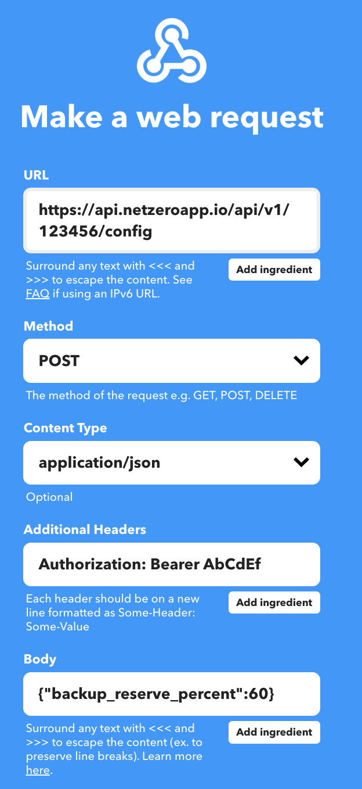

# Netzero API Automation HOWTO


## Introduction
[Netzero for Tesla](https://www.netzeroapp.io) is an iOS/Android/web app designed for monitoring
and optimizing your Tesla Solar/Powerwall system. Netzero offers an API that allows you to
configure your Powerwall system, enabling you to manage configuration changes such as backup
reserve, operational mode, energy exports, and grid charging.


## API Token
Begin by logging into your Tesla account using the web app at https://app.netzeroapp.io. Access
your API token and energy site ID by navigating to the user menu (located at the top right corner).
It's important to keep your API token secure, as while it provides access only to the data
displayed here, it does grant the ability to manage Powerwall configuration.


## Automation with API requests
Note: If you're unfamiliar with running web requests using `curl` or similar tools, you can proceed
to the next section for no-code automation using IFTTT.

To retrieve the current configuration, substitute `$API_TOKEN` and `$SITE_ID` with your respective values obtained above:

```bash
curl -s -H "Authorization: Bearer $API_TOKEN" https://api.netzeroapp.io/api/v1/$SITE_ID/config
{
  "backup_reserve_percent": 80,
  "operational_mode": "autonomous",
  "energy_exports": "pv_only",
  "grid_charging": true,
  "percentage_charged": 98,
  "grid_status": "Active"
}
```

To modify the configuration, send a POST request with new values. You can adjust one or more of the following parameters in the same request:

- `backup_reserve_percent`: Integer values ranging from `0` to `100`.
- `operational_mode`: Select either `autonomous` or `self_consumption`.
- `energy_exports`: Options are `pv_only` (export solar only), `battery_ok` (export everything), or `never` (no export).
- `grid_charging`: Select either `true` or `false`.

You can modify one or more of these values in the same request.

```bash
curl -s -H "Authorization: Bearer $API_TOKEN" -H "Content-Type: application/json" \
    --data '{"backup_reserve_percent": 50, "operational_mode": "self_consumption"}' \
    https://api.netzeroapp.io/api/v1/$SITE_ID/config
{
  "backup_reserve_percent": 50,
  "operational_mode": "self_consumption",
  "energy_exports": "pv_only",
  "grid_charging": true,
  "percentage_charged": 98,
  "grid_status": "Active"
}
```

The response mirrors that of the GET request, providing the updated configuration (inclusive of any changes made) along with the Powerwall's current status.


## Automation with IFTTT

You can utilize the API token to automate Powerwall configuration changes through [IFTTT](https://ifttt.com/) (If This, Then That). For instance, to establish a specific backup reserve percentage daily at a designated time:

1. Visit https://ifttt.com/create.
2. **If This**: Choose Date & Time, then select Every day at, specify the desired time, and create the trigger.
3. **Then That**: Search for the **Webhooks** service, and select Make a web request. Configure the web request as illustrated below
(substitute 123456 with your energy site ID and AaBbCc with your API token).


