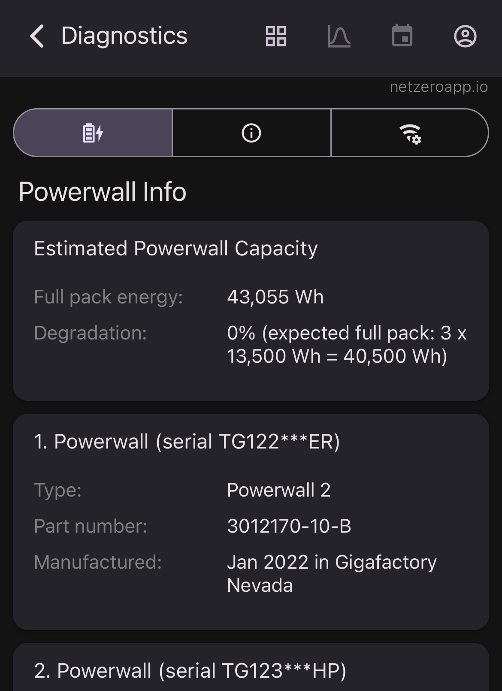

# Netzero - Powerwall Capacity Estimate

## Introduction

[Netzero](https://www.netzeroapp.io) tracks the capacity of your Powerwall batteries and their degradation over time. By connecting directly to your Tesla Gateway or Powerwall+ using the Netzero app, you can obtain diagnostic information, including battery capacity. However, connecting to the Gateway requires you to be on your home network and have access to the Gateway password. Additionally, Tesla has removed Gateway access for Powerwall 3. To address these limitations, Netzero also calculates estimated battery capacity and degradation, providing an alternative way to access this data.



## Estimating Capacity

Powerwall capacity estimates are provided for all connected batteries combined, not for individual units. For instance, with two Powerwalls, you might see a combined capacity of 27 kWh (13.5 kWh each). To obtain the capacity of individual batteries, direct connection to your Tesla Gateway is required.

Capacity estimation involves analyzing historical Powerwall charge and discharge cycles. Netzero identifies days with significant charge cycles (e.g., from 30% to 100%) and estimates capacity by dividing the total charged energy by the change in state of charge. For example, if the Powerwall charges from 9 AM to 2 PM, with the state of charge increasing from 30% to 100%, and the energy charged during this period sums up to 9,800 Wh, the full capacity can be inferred as:

```
9,800 Wh / (100% - 30%) = 14,000 Wh
```

This calculation is repeated with data for multiple different days, to achieve a statistically significant result. Through experimentation, we have determined the most representative days for accurate capacity estimation.

## Accuracy

After finalizing the capacity estimation methodology, we evaluated its accuracy by comparing the estimates with the reported diagnostic capacity values (ground-truth capacity). This comparison, conducted on over one thousand Powerwalls, showed an average capacity error of less than 2%, confirming the reliability of the estimates.

## Troubleshooting

If your estimated capacity is missing, it could be due to several reasons:

- **Backup reserve set to 100%**: This setting prevents Powerwalls from charging or discharging, so capacity estimation is not possible.
- **Recent installation**: Newly installed Powerwalls may not have sufficient data for capacity estimation. Please check again after a week of consistent charging days.
- **Change in the number of Powerwalls**: If you have recently added or removed a Powerwall, capacity estimation needs some time to recalibrate.

## Questions or Issues

For any questions or issues, please submit them here: [Netzero Issues](https://github.com/netzero-labs/netzero/issues).
