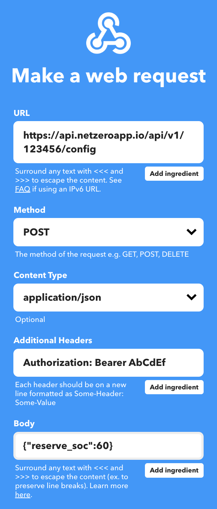

# Netzero - Enphase Battery Automation


## Introduction
[Netzero](https://www.netzeroapp.io) allows you to schedule battery
configuration changes using the app (battery reserve, system profile, and grid charging).

For more advanced use, the app also offers an API that allows to manage these configuration changes.


## API Token
Begin by logging into your Tesla account using the [Netzero app](https://www.netzeroapp.io). Access your
API token and system ID by navigating to the mode menu (first menu in the top-right) and selecting
**Developer Access**. It's important to keep your API token secure, as while it provides access only
to the data displayed here, it does grant the ability to manage battery configuration.


## Automation with IFTTT
You can utilize the API token to automate battery configuration changes through [IFTTT](https://ifttt.com/) (If This, Then That).
For instance, to establish a specific battery reserve percentage daily at a designated time:

1. Visit https://ifttt.com/create or use the IFTTT app.
2. **If This**: "Choose Date & Time", then select "Every day at", specify the desired time, and create the trigger.
3. **Then That**: Search for the "Webhooks" service, and select "Make a web request". Configure the web request as illustrated below.
Substitute `123456` with your system ID and `AbCdEf` with your API token, both obtained above.  Replace `60` with your desired
battery reserve percentage.



Note: Utilizing Webhooks requires a PRO IFTTT plan (currently $3.49/month). For simpler automation, use the in-app
schedule configuration instead. IFTTT is useful for more complex rules (e.g. incorporating weather or other conditions).

You can modify other parameters in addition to battery reserve percentage, see next section for details.


## Automation with API requests

If you're familiar with running web requests using `curl` or similar tools, you can also manage the
configuration with scripts.

To retrieve the current configuration of the system, insert `$API_TOKEN` and `$SYSTEM_ID` values obtained above and run:

```bash
export API_TOKEN="..."
export SYSTEM_ID="..."

curl -s -H "Authorization: Bearer $API_TOKEN" https://api.netzeroapp.io/api/v1/$SYSTEM_ID/config

{
  "system_id": 1234566,
  "battery_mode": "Savings Mode",
  "reserve_soc": 30,
  "energy_independence": "disabled",
  "charge_from_grid": "disabled",
  "battery_shutdown_level": 10,
  "grid_state": "On Grid"
}
```

To modify the configuration, send a POST request with new values. You can adjust one or more of the following parameters in the same request:

- `reserve_soc`: Integer values ranging from `0` to `100` (battery reserve percentage).
- `battery_mode`: Select one of:
  - `Self - Consumption` (maximizes your use of your own solar power while reducing your dependence on electricity from the utility grid),
  - `Savings Mode` (minimizes your electricity bills by reducing consumption from the utility grid during peak hours when energy rates are highest),
  - `Full Backup` (keeps your batteries fully charged so you are always prepared for a power outage).
- `charge_from_grid`: Select either `enabled` or `disabled`.

You can modify one or more of these values in the same request.

```bash
curl -s -H "Authorization: Bearer $API_TOKEN" -H "Content-Type: application/json" \
    --data '{"reserve_soc": 30, "battery_mode": "Self - Consumption"}' \
    https://api.netzeroapp.io/api/v1/$SYSTEM_ID/config

{
  "system_id": 1234566,
  "battery_mode": "Self - Consumption",
  "reserve_soc": 30,
  "energy_independence": "disabled",
  "charge_from_grid": "disabled",
  "battery_shutdown_level": 10,
  "grid_state": "On Grid"
}
```

The response mirrors that of the GET request, providing the updated configuration (inclusive of any changes made).

Here's an example with Python code instead of curl:

```python
import os
import requests

SYSTEM_ID = os.environ['SYSTEM_ID']
api_token = os.environ['API_TOKEN']
config = {'reserve_soc': 30, 'battery_mode': 'Self - Consumption'}

response = requests.post(
    url=f'https://api.netzeroapp.io/api/v1/{SYSTEM_ID}/config',
    headers={'Authorization': f'Bearer {api_token}'},
    json=config,
)
print(response.json())
```

## Questions or Issues
You can submit issues or post questions here: [Netzero Issues](https://github.com/netzero-labs/netzero/issues).
