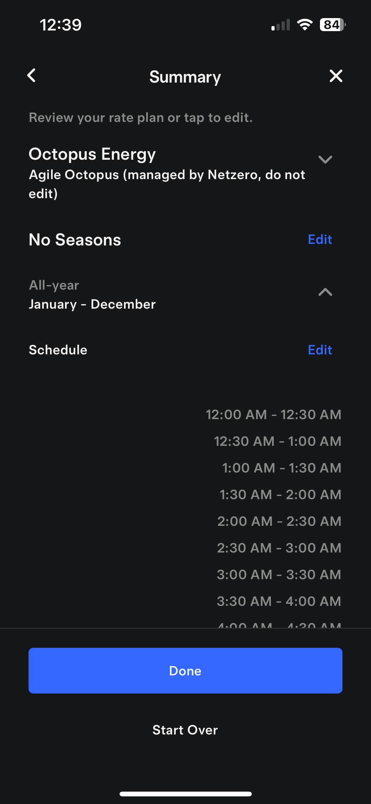
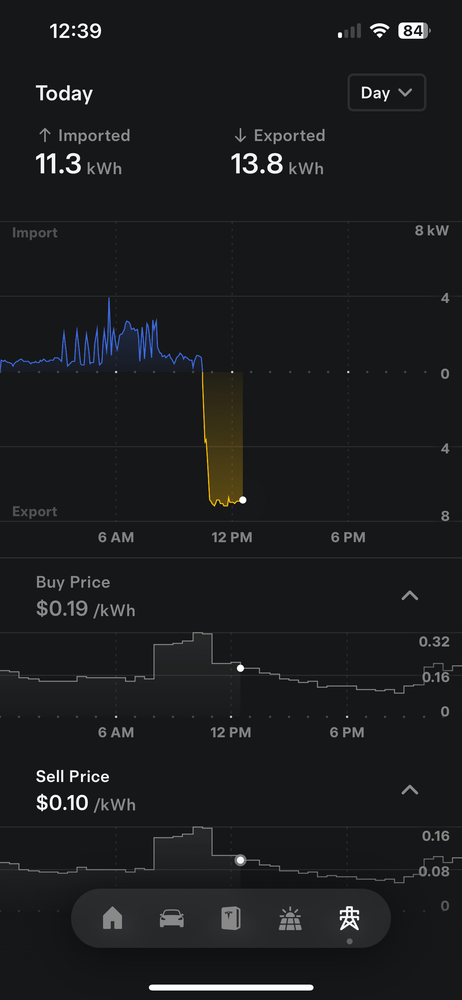

# Netzero - Dynamic Electricity Pricing

## Introduction
[Netzero](https://www.netzeroapp.io) is an iOS/Android/web app designed for monitoring
and optimizing your Tesla Solar/Powerwall system. Netzero is adding support for dynamic
electricity pricing (also known as dynamic tariffs, real-time pricing, or wholesale pricing).
These utility plans have pricing that reflects the variation in wholesale electricity costs
due to changes in supply and demand.  The prices change frequently (as frequently as every
30 minutes) and are usually forecast for the next 24 hours.

Powerwall uses the utility rate plan to optimize its Time-Based Control.  Netzero adds the
ability to automatically update dynamic tariffs (based on the published prices),
thus ensuring optimal Time-Based Control.

By shifting usage based on real-time pricing (e.g. reducing usage during expensive peaks),
users can save on electricity costs.  A Powerwall system in combination with accurate rate plans is
a great way to achieve that goal!

## Supported Plans

Netzero is currently piloting support for the following plans:
- [Agile Octopus](https://octopus.energy/smart/agile/) (Octopus Energy, UK)
- [Tibber](https://tibber.com/en) (Sweden, Norway, Germany & the Netherlands)
- [Amber Electric](https://www.amber.com.au/) (Australia)

If you are in a region with a supported provider, you will see a "Utility Rate Plan" option in the
main menu.

We will add support for additional plans and utilities in the future, [let
us know](mailto:feedback@netzeroapp.io) if you're currently on a dynamic plan and
would like to participate.

## Agile Octopus Configuration

If you're currently on an Agile Octopus plan, configure your region, import and export
tariff, and check the "Automatically update rate plan" checkbox.  This will result in a few changes:
- Your prior tariff configuration will be overridden.  In the future, the app will allow
  restoring the original plan; for now, make sure to separately store your existing rate plan if
  you created it manually and might need it in the future.
- Your new tariff configuration will reflect the current pricing schedule.  You can confirm the
  pricing using the [Agile Dashboard](https://agile.octopushome.net/dashboard).
- As new tariffs are announced (usually around 4pm), the tariff configuration will be
  automatically updated.  You do not need to keep the app open for that.

Note that the Tesla app's Utility Rate Plan section doesn't display dynamic tariffs properly:

We will work with the Tesla team to make sure this gets corrected.  For now, you can instead use the
Buy and Sell charts (shown by scrolling down under the Grid chart) to display the real-time prices:

Note: for plans with fixed outgoing (sell) prices, the sell prices are adjusted to never exceed buy
prices.  This results in better Powerwall behavior (more cycling when required), due to a limitation
in Tesla's Time-Based Control algorithm.

## Tibber and Amber Electric Configuration

Tibber and Amber Electric plans can be configured by providing your API token from the provider.  Follow the instructions in the app.

## Disabling Automatic Updates

If you wish to stop updating your dynamic tariffs, uncheck the "Automatically update rate plan"
checkbox under "Utility Rate Plan".  Make sure to also configure a new fixed rate plan with the
Tesla app, using the Start Over button.

## Feedback

Send any questions, comments, or issues to [feedback@netzeroapp.io](mailto:feedback@netzeroapp.io).
